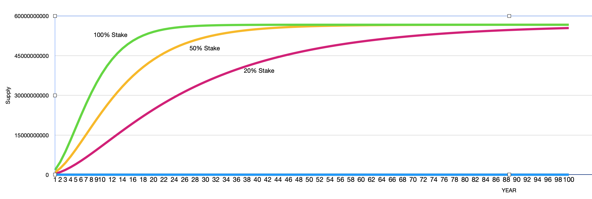

# **$NEW** Economic Model

**Draft v0.1: July 14, 2022** 

[xiawu@newtonproject.org](xiawu@newtonproject.org)

## 1 Introduction

The economic model of a digital currency or asset is an extremely critical component of a blockchain platform. This article will discuss the economic model of Newton blockchain's native currency **$NEW**, including governance, supply, mining incentives, fee mechanism.

### 1.1 **$NEW** Properties

*  **$NEW** is the native currency of the Newton blockchain.
*  **$NEW** is a constant amount of money, up to 100 billion.
*  When Newton 2.0 goes live, **$NEW** will be the currency of total deflation.
*  The amount of mining bonus the validators get is proportional to the amount of staking **$NEW**.
*  The longer the validators lock, the more rewards.
*  The validators are rewarded with Proof of Uptime (PoU).

## 2 Governance

Governance has played a key role in the evolution of the Newton blockchain platform. The Newton blockchain uses a built-in consensus algorithm to build a set of mechanisms for dynamically modifying system parameters. Any validator can initiate a proposal to modify system parameters or participate in a decision vote.

The system parameters are listed as follows:

> $\theta$ - Minimum stake amount, default value is 10M **$NEW**
>
> $\delta_{min}$ - Minimum stake duration, default value is 2 weeks
>
> $\delta_{max}$ - Maximum stake duration, default value is 52 weeks
>
> $p$ - Stake fee, default value is 0.005
>
> $\lambda$ - Ratio of fee burned, default value is 0.5
>
> $\mathcal{F}$ - Fee structure
>
> $\alpha$, $\beta$, $\gamma$ - Parameters of minting function, default value of $\alpha$, $\beta$, $\gamma$ is 1.15$,$1$, $$0.2$ 

Where  $\mathcal{F}$ will be explained in later documents.

**$NEW** Governance follows its own design philosophy of ensuring predictability and security in the short term while giving systems flexibility and control in the long term. Design philosophy is embodied in two aspects, including:

* The modification of system parameters is delayed, including the effective time of parameters and the frequency of parameter modification.
* The range of system parameters to be modified is limited. Otherwise, system stability may be affected.

## 3 Supply

**$NEW** has a hard top of 100B, of which 60B is generated through mining incentives. As of February 1, 2023, the remaining supply is 56665276147.8292.

we make the following Settings:

> $j$ - year，for example, $1, 2, 3, ...$ 
>
> $C_j$ - circulating supply of year $j$$, C_0$ is 0
>
> $R_j$ - unminted amount on year $j$
>
> $u$ - user $u$
>
> $amount_{u,stake}$ - stake amount of user $u$
>
> $time_{u,stake}$ - stake duration of user $u$, unit is week

$$
C_j = C_{j-1} + \gamma \times \sum_{\forall u}f(amount_{u,stake}, time_{u, stake}) \times R_j \times \frac{\sum_{i=0}^{j} \frac{1}{(\alpha + \frac{1}{1+i^\beta})^i}}{T}
$$

where
$$
T = \sum_{i = 0}^{\infty} \frac{1}{(\alpha + \frac{1}{1+i^\beta})^i}
$$
Starting in 2023, the supply rule for **$NEW** will use Equation 1. Like bitcoin and others, the supply will decrease year by year. **$NEW** will be scarce due to the built-in destruction mechanism. The following figure shows the supply curve of **$NEW** under the conditions of 20% stake, 50% stake and 100% stake.

$$
f(amount_{u,stake},time_{u,stake}) = (0.002 \times time_{u, stake} + 0.896) \times \frac{amount_{u,stake}}{C_j}
$$

As shown in Equation 3, the annual supply quantity of **$NEW** will be proportional to the stake amount and stake time. This feature is conducive to the stability and security of the blockchain network in the short and medium term.

## 4 Minting Incentive

The minting of **$NEW** is used to incentive nodes to work honestly, process transactions, and maintain network security. This is done through special minting transactions.

The node gains the right to participate in the consensus process by stake **$NEW**. All rewards of nodes are related to running time and response delay, that is, PoU(Proof of Uptime) proves that this design is also beneficial to the diversity of nodes in the future network.

Due to the consensus mechanism of randomly selecting block nodes, the casting process of **$NEW** does not produce the Matthew effect of "the rich get richer".

## 5 Fee Mechanism

Starting with newton 2.0, the Newton blockchain fee mechanism was completely redesigned, following the principle that the transfer and consumption of fees must be fair to all **$NEW** holders.

* Stake fee

  The stake is done through a special transaction type, and a certain percentage of the process as a stake fee. The stake amount multiplied by $p$ is the stake handling fee. Unlike other blockchains, the stake fee is completely burned.

* Transaction fee

  Percentage  $\lambda$ of the transaction fee will be destroyed.

  A more efficient transaction fee setting mechanism will be described in later documents.

  

## Reference

1. Newton: Newton whitepaper v0.6, https://www.newtonproject.org/static-v1/whitepaper/newton-whitepaper-0.6-release-english.pdf